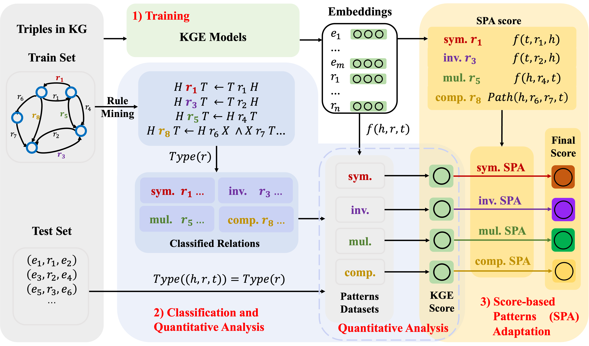

# Quantitative analysis over relational patterns and SPA

[](https://arxiv.org/abs/2308.07889)
[](https://iswc2023.semanticweb.org/)

### This repository contains code for:
-*[A Comprehensive Study on Knowledge Graph Embedding over Relational Patterns Based on Rule Learning](https://arxiv.org/abs/2308.07889)*

>Though KGE models' capabilities are analyzed over different relational patterns in theory, a comprehensive **`quantitative analysis`** on KGE models **`over relational patterns`** remains absent. To address this challenge, we evaluate the performance of **7 KGE models** over **4 common** relational patterns on **2 benchmarks**, then conduct an analysis in **theory**, **entity frequency**, and **part-to-whole** three aspects and get some counterintuitive conclusions. Finally, we introduce a **training-free** method **Score-based Patterns Adaptation (`SPA`)** to enhance KGE models' performance over various relational patterns. 


## 🌈 Model Architecture



## 📕 Usage
- `src/`:
    - `SPA/`: include SPA codes.
- `dataset/`: 
    - `dataset/FB15K237/`: FB15k-237 dataset resources
    - `dataset/WN18RR/`: WN18RR dataset resources
    - `dataset/amie3.jar`: rule mining tool AMIE3
    - `dataset/classify.py`: Quantitative analysis over relational patterns
- `output/`: 
    - `output/link_prediciton/FB15K237/`: model outputs for FB15k-237 dataset
    - `output/link_prediciton/WN18RR/`: model outputs for WN18RR dataset
- `logging/`: include train logging files.
- `scripts/`: include train shell files.
- `quantitative_analysis.py`: Quantitative analysis over relational patterns 

## 💡 Training and Testing

### **Step1** Create a virtual environment using ```Anaconda``` and enter it
```bash
conda create -n spa python=3.8
conda activate spa
```

### **Step2** Install package
```bash
pip install -r requirements.txt
```

### **Step3** Classify relations and triples with AMIE3
```bash
# python dataset/classify.py arg1 arg2 arg3
# arg1 is the dataset be chosen which FB15k237 and WN18RR are available
# arg2 is the PCA with AMIE3
# arg3 is the HC  with AMIE3
python dataset/classify.py FB15k237 0.8 0.5
python dataset/classify.py WN18RR 0.8 0.5
```

### **Step4** Quantitative analysis over relational patterns
```bash
python quantitative_analysis.py
```

### **Step5** Train and test KGE model
```bash
# FB15k-237
sh scripts/FreeBase/TransE_FB.sh
sh scripts/FreeBase/RotatE_FB.sh
sh scripts/FreeBase/HAKE_FB.sh
sh scripts/FreeBase/DistMult_FB.sh
sh scripts/FreeBase/ComplEx_FB.sh
sh scripts/FreeBase/DualE_FB.sh
sh scripts/FreeBase/PairRE_FB.sh
```

```bash
# WN18RR
sh scripts/WordNet/TransE_WN.sh
sh scripts/WordNet/RotatE_WN.sh
sh scripts/WordNet/HAKE_WN.sh
sh scripts/WordNet/DistMult_WN.sh
sh scripts/WordNet/ComplEx_WN.sh
sh scripts/WordNet/DualE_WN.sh
sh scripts/WordNet/PairRE_WN.sh
```

### **Step6** Combine KGE socre with SPA score

**Before `Step6`**, please **NOTE**:
- Replace the data in the test `{DATASET}` with the data under the `{PATTERN}` dataset.
```bash 
#{DATASET} = {FB15K237, WN18RR}
#{PATTERN} = {symmetric, inverse, multiple, compose2}
cat dataset/{DATASET}/relation_classify/minhc_0.5_minpca_0.8_maxad_4/{PATTERN}/num_constrain_0.txt > dataset/{DATASET}/test.txt
```
- Make sure the parameter setting in `scripts/FreeBase_SPA/{KGE}_FB.sh` and `scripts/WordNet_SPA/{KGE}_WN.sh` which includes:
    -  the path of trained model `--checkpoint_dir` 
    -  For `symmetric`, use pattern weight `--use_sym_weight` and lambda of pattern `--lambda_sym`
    -  For `inverse`, use pattern weight `--use_inv_weight` and lambda of pattern `--lambda_inv`
    -  For `multiple`, use pattern weight `--use_sub_weight` and lambda of pattern `--lambda_sub`
    -  For `compose2`, use pattern weight `--use_comp2_weight` and lambda of pattern `--lambda_comp2`

```bash
# FB15k-237
sh scripts/FreeBase_SPA/TransE_FB.sh
sh scripts/FreeBase_SPA/RotatE_FB.sh
sh scripts/FreeBase_SPA/HAKE_FB.sh
sh scripts/FreeBase_SPA/DistMult_FB.sh
sh scripts/FreeBase_SPA/ComplEx_FB.sh
sh scripts/FreeBase_SPA/DualE_FB.sh
sh scripts/FreeBase_SPA/PairRE_FB.sh
```

```bash
# WN18RR
sh scripts/WordNet_SPA/TransE_WN.sh
sh scripts/WordNet_SPA/RotatE_WN.sh
sh scripts/WordNet_SPA/HAKE_WN.sh
sh scripts/WordNet_SPA/DistMult_WN.sh
sh scripts/WordNet_SPA/ComplEx_WN.sh
sh scripts/WordNet_SPA/DualE_WN.sh
sh scripts/WordNet_SPA/PairRE_WN.sh
```

**Note**: 
- Default `.sh` files have been set the best hyperparameters, you can open the `.sh` file for parameter modification.

### Acknowledgement
- Our prior work: [```NeuralKG```](https://github.com/zjukg/NeuralKG)
- We appreciate [```AMIE```](https://github.com/dig-team/amie) and many other related works for their open-source contributions.

## 🤝 Cite:
Please condiser citing this paper if you use the ```code``` from our work.
Thanks a lot :)

```bigquery
@article{jin2023comprehensive,
  title={A Comprehensive Study on Knowledge Graph Embedding over Relational Patterns Based on Rule Learning},
  author={Jin, Long and Yao, Zhen and Chen, Mingyang and Chen, Huajun and Zhang, Wen},
  journal={arXiv preprint arXiv:2308.07889},
  year={2023}
}
```

<!-- ## 💡 Acknowledgement
- Our Open-source Tools: [NeuralKG](https://github.com/zjukg/NeuralKG)
- We appreciate [```AMIE```](https://github.com/dig-team/amie), [```MSNEA```](https://github.com/liyichen-cly/MSNEA), [```EVA```](https://github.com/cambridgeltl/eva), [```MMEA```](https://github.com/liyichen-cly/MMEA) and many other related works for their open-source contributions. -->